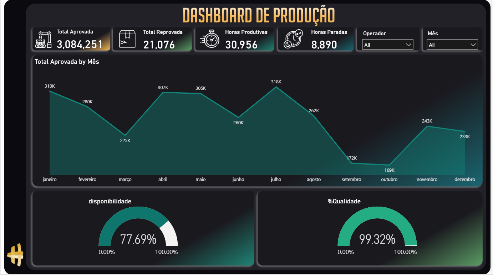

# 📊 Dashboard de Performance Operacional e Produção

Este repositório contém um projeto de Business Intelligence desenvolvido para monitorar indicadores de produção, qualidade e disponibilidade operacional. O objetivo foi transformar dados operacionais em insights estratégicos capazes de apoiar a tomada de decisão, identificar gargalos produtivos e acompanhar a eficiência da operação ao longo do tempo.

## 🚀 Destaques do Projeto

* **Análise Operacional:** Estruturação dos dados para monitorar produção aprovada, produção reprovada, disponibilidade operacional e indicadores de qualidade.
* **Dashboard Interativo:** Implementação de filtros dinâmicos por período e operador, permitindo análises detalhadas do desempenho produtivo sob diferentes perspectivas.
* **KPIs Estratégicos:** Desenvolvimento de indicadores voltados para acompanhamento rápido da eficiência operacional, produtividade e qualidade.
* **Visualização de Dados:** Construção de um painel intuitivo para facilitar a interpretação das métricas e apoiar decisões baseadas em dados.
* **Análise Temporal:** Comparação do desempenho operacional ao longo dos meses para identificação de tendências e oportunidades de melhoria contínua.

## 🛠️ Tecnologias Utilizadas

* **Power BI Desktop** (Construção dos visuais, ETL e Modelagem)
* **Power Query** (Transformação e tratamento dos dados)
* **Linguagem DAX** (Criação de medidas, KPIs e cálculos de negócio)
* **Modelagem de Dados** (Relacionamentos e estrutura analítica)

## 📈 Indicadores Monitorados

* Produção Aprovada
* Produção Reprovada
* Horas Produtivas
* Horas Paradas
* Disponibilidade Operacional
* Índice de Qualidade

## 📁 Como Auditar o Projeto Técnico

O arquivo fonte original está totalmente disponível neste repositório para análise técnica.

Você pode fazer o download do arquivo **`.pbix`** diretamente no projeto para inspecionar:

1. A modelagem de tabelas e relacionamentos.
2. As fórmulas e medidas DAX utilizadas.
3. O tratamento e transformação dos dados no Power Query.
4. A construção dos KPIs operacionais.
5. A estrutura dos filtros e segmentações.
6. As boas práticas aplicadas na visualização de dados.

## 💡 Objetivos de Negócio

Através deste dashboard é possível:

* Monitorar a eficiência operacional da produção.
* Identificar períodos com aumento de horas paradas.
* Avaliar impactos na qualidade da produção.
* Comparar desempenho entre operadores.
* Detectar tendências operacionais ao longo do tempo.
* Apoiar decisões orientadas por dados para melhoria contínua.

## 👨‍💻 Autor

**Chris Alex Borges de Santana Januário**

🔗 LinkedIn: https://www.linkedin.com/in/chrisjanuario

🔗 GitHub: https://github.com/7alexch
